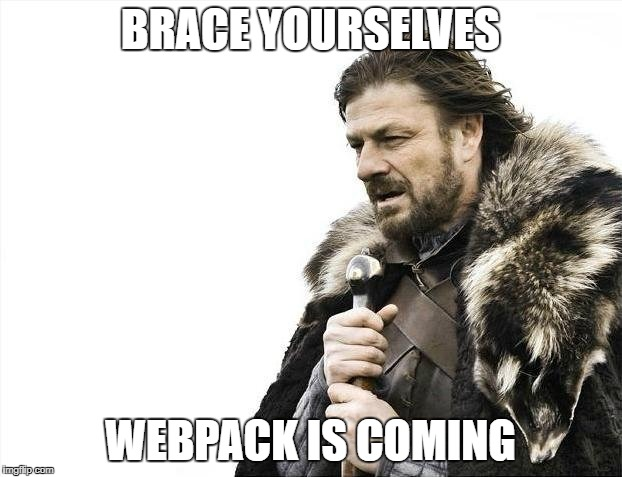

# Webpack Project

This repository contains a series of tasks aimed at learning and practicing setting up Webpack for JavaScript projects. Each task focuses on different aspects of Webpack configuration, including bundling JavaScript files, handling CSS and image assets, setting up development servers, and optimizing builds.

## Task Structure

The project is divided into multiple tasks, each focusing on specific Webpack configurations and features:

1. **Task 0: Basic Setup**
   - Setting up Webpack for a basic project.
   - Adding jQuery and creating a simple HTML structure using Webpack.

2. **Task 1: Adding CSS & Images**
   - Configuring Webpack to support CSS and image assets.
   - Styling the HTML elements using CSS.
   - Optimizing image loading in CSS.

3. **Task 2: Specific Configuration**
   - Customizing Webpack configuration to handle CSS and image assets in a specific way.
   - Setting up image backgrounds and styling elements.

4. **Task 3: Dev Servers, Modules, and Tree Shaking**
   - Setting up a development server for faster development.
   - Dividing code into modules and optimizing build size.
   - Improving development speed and build performance.

## Running the Project

To run the project, follow these steps:

1. Clone the repository to your local machine.
2. Navigate to the respective task directory.
3. Install dependencies using npm:

```
npm install
```

4. Run the project using npm scripts:

- For building the project:

  ```
  npm run build
  ```

- For starting the development server:

  ```
  npm run start-dev
  ```

## Project Structure

The project structure for each task follows a similar pattern:

- **src/**: Contains the source code files.
- **public/**: Contains the HTML files and the bundled JavaScript files generated by Webpack.
- **css/**: Contains CSS files used in the project.
- **assets/**: Contains image assets used in the project.

## Additional Notes

- Each task comes with its own specific requirements and configurations as mentioned in the task descriptions.
- Ensure that you have Node.js and npm installed on your machine before running the project.
