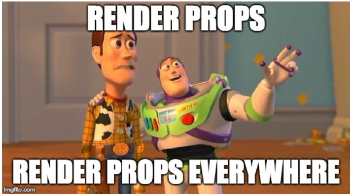

# ALX React Props Project

## Table of Contents
1. [Project Overview](#project-overview)
2. [Setup Instructions](#setup-instructions)
3. [Components](#components)
    - [NotificationItem](#notificationitem)
    - [Notifications](#notifications)
    - [CourseListRow](#courselistrow)
    - [CourseList](#courselist)
    - [App](#app)
4. [PropTypes and Shapes](#proptypes-and-shapes)
5. [Testing](#testing)
6. [Styling](#styling)
7. [Contributing](#contributing)
8. [License](#license)

## Project Overview

This project demonstrates the usage of React props, PropTypes, and various React components to build a simple dashboard with notifications and a course list. The primary focus is on passing props correctly and ensuring type safety using PropTypes.

## Setup Instructions

To set up the project locally, follow these steps:

1. Clone the repository:
   ```
   git clone https://github.com/fazzy12/alx-react.git
   cd alx-react/0x02-react_props/task_5/dashboard
    ```

2. Install the dependencies:

```
npm install
```

3. Run the development server:

```
npm start
```

4. Open your browser and navigate to http://localhost:8080 to see the application running.


### Components
### NotificationItem

`NotificationItem` is a component that displays an individual notification.

**Props**:

- type (string, required): The type of notification (e.g., "default", "urgent").
- value (string, optional): The notification message.
- html (object, optional): An object with a __html property containing HTML to be displayed.

### Notifications

`Notifications` is a component that displays a list of notifications.

**Props**:

- listNotifications (array, optional): An array of objects representing notifications.

### CourseListRow

`CourseListRow` is a component that displays a row in the course list.

**Props**:

- isHeader (boolean, optional): Whether the row is a header row.
- textFirstCell (string, optional): The text to display in the first cell.
- textSecondCell (string, optional): The text to display in the second cell.

### CourseList

`CourseList` is a component that displays a list of courses.

**Props**:

- listCourses (array, optional): An array of objects representing courses.

### App

`App` is the main component that renders the dashboard.

## PropTypes and Shapes

The project uses PropTypes to ensure type safety for the props passed to each component. The PropTypes are defined in the respective component files.

## Testing

The project includes a test suite using Jest and React Testing Library. To run the tests, use the following command:

```
npm test
```

## Styling

The project uses CSS for styling. The styles are defined in the `App.css` file.

## Contributing

Contributions are welcome! Please feel free to submit a PR if you would like to make any improvements to the project.
