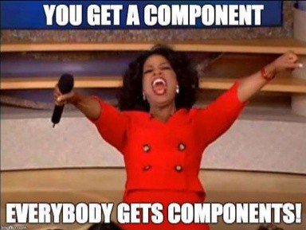

# React component

## Overview
This project is a part of the ALX React curriculum. It focuses on building a functional and performant React application using various React features, including components, state management, lifecycle methods, higher-order components (HOCs), and testing with Jest and Enzyme. The project is organized into multiple tasks, each with specific requirements to enhance your understanding of React.

### Installation
To get started with the project, follow these steps:

1. Clone the repository:

```
git clone https://github.com/fazzy12/alx-react.git
```
2. Navigate to the project directory:

```
cd alx-react/0x03-React_component
```

3. Install the dependencies:


```
npm install
```


### usage
To run the project locally:


1. Start the development server:

```
npm start
```

2. Open your browser and navigate to `http://localhost:3000/` to view the application.

### Testing
To run the tests for the project, use the following command:

```
npm test
```

The tests are written using Jest and Enzyme to ensure the components are working as expected.

### Author
This project was created by [Ifeanyi Kalu](https://github.com/fazzy12) as part of the ALX React curriculum

#### License
This project is licensed under the [MIT License](https://opensource.org/licenses/MIT).
